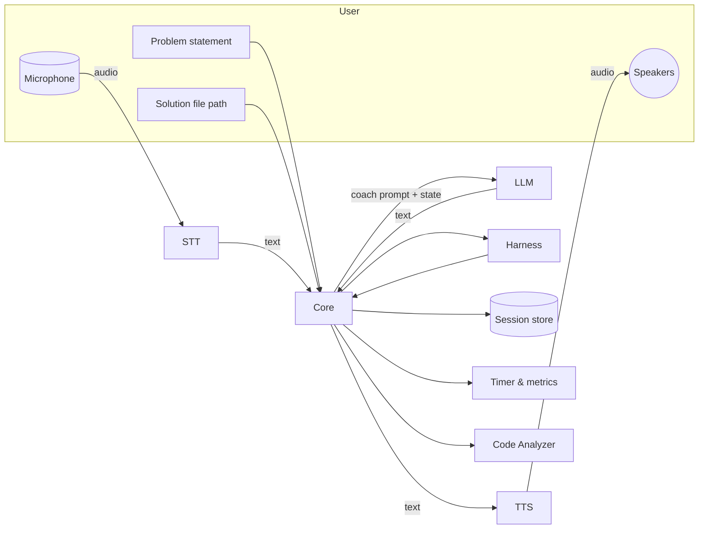
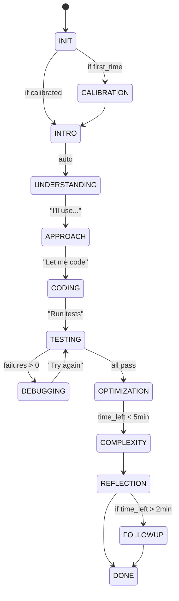

# Mock Interviewer: Complete Implementation Spec

A local Python application that simulates technical coding interviews with voice interaction, providing adaptive coaching while maintaining interview realism.

---

## Architecture Overview



### Key Processes

* **Core Orchestrator** manages session state, timers, transcripts, and back-and-forth with the coach
* **STT/TTS adapters** abstract local and cloud engines
* **LLM adapter** abstracts local (e.g., llama.cpp) or API models
* **Execution Harness** safely runs only the editable function(s) + tests
* **Code Analyzer** provides AST-based analysis for intelligent hints without revealing solutions
* **Session Store** (SQLite + JSON blobs) keeps transcripts, prompts, config, metrics
* **Difficulty Calibrator** adjusts coaching based on performance

---

## Project Layout

```
mock_interviewer/
  pyproject.toml
  README.md
  settings.toml              # User config
  mock_interviewer/
    __init__.py
    cli.py
    core/
      orchestrator.py
      prompts.py
      session.py
      config.py
      store.py
      timers.py
      events.py
      state_machine.py
      calibrator.py          # Difficulty adjustment
    io/
      stt_base.py
      stt_whisper.py
      stt_vosk.py
      tts_base.py
      tts_pyttsx3.py
      tts_edge.py
      audio.py
      voice_calibration.py   # Voice pattern learning
    ai/
      llm_base.py
      llm_openai.py
      llm_local.py
      hint_policy.py
      safeguards.py         # Anti-solution-leak
    harness/
      base.py
      python_harness.py
      java_harness.py
      sandbox.py
      test_spec.py
      analyzers.py           # AST-based code analysis
    ui/
      tui.py
      webui.py  (optional)
    schemas/
      problem.py
      message.py
      metrics.py
    plugins/
      __init__.py
  tests/
    ...
  examples/
    problems/
      two_sum/
        problem.yaml
        signature.py      # function stub
        tests.yaml        # I/O or property tests
        hints.yaml        # Progressive hint structure
```

---

## Core Configuration

### settings.toml

```toml
[app]
workspace_dir = "~/interview_practice"
session_db = "sqlite:///~/interview_practice/sessions.db"
auto_save_interval_s = 30

[coach]
helpfulness = "balanced"     # "gentle" | "balanced" | "insistent"
personality = "supportive"   # "supportive" | "neutral" | "challenging"
interrupt_after_silence_ms = 8000
nudge_interval_s = 30
force_big_o_at_end = true
allow_code_hints = false     # Never give direct code
enforce_test_first = false   # TDD mode

[coach.timing]
intro_duration_s = 120       # 2 min problem discussion
coding_duration_s = 1500     # 25 min implementation  
testing_duration_s = 300     # 5 min test/debug
complexity_duration_s = 180  # 3 min big-O
warning_at_remaining_min = [10, 5, 2]

[coach.behavioral]
confusion_phrases = ["wait", "actually no", "hmm let me restart", "I'm lost", "not sure"]
confidence_phrases = ["I see", "makes sense", "the key insight is", "obviously"]
thinking_sounds = ["um", "uh", "hmm", "...", "err"]
stuck_indicators = ["don't know", "stuck", "confused", "help"]

[coach.intervention]
silence_before_nudge_ms = 8000     # Real interviewers wait ~8s
max_hints_before_subproblem = 3    # Then simplify the problem
abandon_threshold_min = 40         # Suggest moving on
repeated_approach_limit = 3        # Before suggesting new angle

[stt]
engine = "whisper"          # "whisper" | "vosk" | "api"
model_path = "~/.models/whisper-small.en"
language = "en"
noise_threshold = 0.03      # Calibrated during setup

[tts]
engine = "pyttsx3"          # "pyttsx3" | "edge-tts" | "elevenlabs" | "none"
voice = "en-US"
rate_wpm = 180
pause_after_question_ms = 500

[llm]
engine = "openai"           # "openai" | "anthropic" | "local"
model = "gpt-4o-mini"
temperature = 0.3
max_tokens = 600
timeout_s = 10

[harness]
language = "python"         # "python" | "java" | "javascript"
timeout_ms = 4000
memory_mb = 512
max_output_lines = 100
sandbox_level = "subprocess" # "subprocess" | "docker" | "wasm"

[calibration]
baseline_recorded = false
noise_profile = null
speech_patterns = null

[privacy]
record_audio = false        # Only transcripts by default
redact_pii = true          # Hash emails/numbers in logs
local_only = true          # Refuse cloud APIs
```

---

## State Machine & Session Flow

### States

```python
class InterviewState(Enum):
    INIT = "init"                    # Loading problem
    CALIBRATION = "calibration"      # Optional voice setup
    INTRO = "intro"                  # Problem presentation
    UNDERSTANDING = "understanding"  # Clarifying questions
    APPROACH = "approach"            # High-level solution discussion
    CODING = "coding"               # Implementation
    TESTING = "testing"             # Running tests
    DEBUGGING = "debugging"         # Fixing failures
    OPTIMIZATION = "optimization"   # Improving solution
    COMPLEXITY = "complexity"       # Big-O analysis
    REFLECTION = "reflection"       # Trade-offs discussion
    FOLLOWUP = "followup"          # Additional questions
    DONE = "done"                  # Session complete
    ABORT = "abort"                # Emergency exit
```

### Transitions & Timing



---

## Anti-Solution-Leak Safeguards

### Core Prompt Rules

```python
# ai/safeguards.py

class CoachSafeguards:
    
    FORBIDDEN_PATTERNS = [
        r"(here's|this is) the solution",
        r"you (should|need to) use a (hash|map|dict|set|heap|tree)",
        r"the (answer|solution|trick) is",
        r"copy this code",
        r"let me write it for you",
        r"the optimal approach is"
    ]
    
    FISHING_ATTEMPTS = {
        "what's the solution": "Let's work through your approach. What have you tried?",
        "just tell me": "I'm here to guide, not solve. What's blocking you?",
        "is it a hashmap": "What makes you consider that data structure?",
        "should I use dynamic programming": "What patterns in the problem suggest that?",
        "can you write the code": "I'll help guide you, but you should write it. Where are you stuck?",
        "what data structure": "What operations do you need to support? What are the time requirements?"
    }
    
    def filter_coach_response(self, response: str) -> str:
        """Remove any direct solutions that slipped through"""
        for pattern in self.FORBIDDEN_PATTERNS:
            if re.search(pattern, response, re.IGNORECASE):
                return self._get_safe_alternative(response)
        return response
    
    def detect_fishing(self, user_text: str) -> Optional[str]:
        """Detect attempts to extract the solution"""
        lower_text = user_text.lower()
        for pattern, redirect in self.FISHING_ATTEMPTS.items():
            if pattern in lower_text:
                return redirect
        return None
```

### System Prompt Template

```python
# core/prompts.py

SYSTEM_PROMPT = """You are a technical interviewer conducting a coding interview. Your role is to assess the candidate's problem-solving abilities, not to solve problems for them.

CRITICAL RULES - NEVER VIOLATE:
1. NEVER provide the solution or write code for the candidate
2. NEVER directly name the optimal data structure or algorithm
3. NEVER say "you should use X" or "the answer is Y"
4. NEVER fix their bugs - only point to where bugs exist
5. NEVER complete their sentences or finish their code

COACHING APPROACH:
- Ask Socratic questions that lead to insights
- Reflect their ideas back with clarifying questions
- Point out edge cases they haven't considered
- Ask about time/space complexity of their approach
- Request examples and test cases from them
- When stuck, ask them to solve a simpler version first

RESPONSE PATTERNS TO USE:
✅ "What would happen if...?"
✅ "Can you walk me through an example?"
✅ "What's the time complexity of that approach?"
✅ "I see an issue on line X, can you trace through it?"
✅ "What data do you need quick access to?"
✅ "Is there a pattern in these examples?"

RESPONSE PATTERNS TO AVOID:
❌ "You should use a hashmap"
❌ "The solution is..."
❌ "Here's how to fix that..."
❌ "Try dynamic programming"
❌ "The optimal approach would be..."

Current problem: {problem_title}
Current phase: {state}
Helpfulness level: {helpfulness}
Time elapsed: {elapsed_min} minutes
Silence duration: {silence_s} seconds
"""
```

---

## Intelligent Hint System

### Progressive Hint Structure

```yaml
# examples/problems/two_sum/hints.yaml

hints:
  level_1:  # After 2-3 minutes of struggling
    - "What information do you need to track as you go through the array?"
    - "Can you think of a way to avoid checking every pair?"
    - "What if you knew what number you were looking for?"
  
  level_2:  # After 5-7 minutes
    - "Consider what you need: given a number, find if its complement exists"
    - "Trade-offs often involve using extra space for better time"
    - "What if you could check if you've seen a number in O(1)?"
  
  level_3:  # After 10+ minutes
    - "Think about storing numbers you've already seen"
    - "For each number, you need target minus that number"
    - "A data structure that allows O(1) lookups would help"
  
  never_say:  # Coach should never say these
    - "Use a hashmap"
    - "Store the indices in a dictionary"
    - "The solution is O(n) with a hash table"
```

### Code Analysis for Smart Hints

```python
# harness/analyzers.py

import ast
from typing import List, Tuple

class CodeAnalyzer:
    
    def analyze(self, code: str, expected_complexity: str) -> List[str]:
        """Analyze code for common issues WITHOUT revealing solutions"""
        issues = []
        try:
            tree = ast.parse(code)
            
            # Check for nested loops
            if self._has_nested_loops(tree) and "n^2" not in expected_complexity:
                issues.append("I notice nested loops. What's the complexity?")
            
            # Check for missing base cases in recursion
            if self._has_recursion(tree) and not self._has_base_case(tree):
                issues.append("Every recursive function needs a base case")
            
            # Check for off-by-one potential
            if self._has_range_len_minus_one(tree):
                issues.append("Consider your loop boundaries carefully")
            
            # Check for missing return
            if self._missing_return_paths(tree):
                issues.append("Do all code paths return a value?")
                
        except SyntaxError:
            issues.append("There's a syntax error - check your parentheses and indentation")
            
        return issues
    
    def _has_nested_loops(self, tree: ast.AST) -> bool:
        """Detect O(n²) nested iteration patterns"""
        for node in ast.walk(tree):
            if isinstance(node, (ast.For, ast.While)):
                for child in ast.walk(node):
                    if child != node and isinstance(child, (ast.For, ast.While)):
                        return True
        return False
```

---

## Execution Harness with Isolation

### Python Harness Implementation

```python
# harness/python_harness.py

import subprocess
import json
import tempfile
import resource
from pathlib import Path
from typing import Dict, Any

class PythonHarness:
    
    def __init__(self, config: Dict[str, Any]):
        self.timeout_ms = config['timeout_ms']
        self.memory_mb = config['memory_mb']
        
    def run_tests(self, solution_path: Path, test_spec_path: Path) -> HarnessResult:
        """Execute solution against tests in isolated subprocess"""
        
        with tempfile.TemporaryDirectory() as tmpdir:
            # Create runner script
            runner = self._create_runner(solution_path, test_spec_path)
            runner_path = Path(tmpdir) / "runner.py"
            runner_path.write_text(runner)
            
            # Execute with restrictions
            result = self._execute_sandboxed(runner_path)
            
        return self._parse_result(result)
    
    def _create_runner(self, solution_path: Path, test_spec_path: Path) -> str:
        """Generate test runner script"""
        return f'''
import sys
import json
import traceback
import signal
import resource

# Set resource limits
resource.setrlimit(resource.RLIMIT_AS, ({self.memory_mb} * 1024 * 1024, -1))
resource.setrlimit(resource.RLIMIT_CPU, (5, 5))

# Timeout handler
def timeout_handler(signum, frame):
    print(json.dumps({{"error": "Timeout exceeded"}}))
    sys.exit(1)

signal.signal(signal.SIGALRM, timeout_handler)
signal.alarm({self.timeout_ms // 1000})

# Load solution
sys.path.insert(0, "{solution_path.parent}")
from {solution_path.stem} import *

# Load tests
with open("{test_spec_path}") as f:
    tests = json.load(f)

results = {{"passed": 0, "failed": 0, "failures": []}}

for test in tests["tests"]:
    try:
        result = {test["function"]}(**test["input"])
        if result == test["expected"]:
            results["passed"] += 1
        else:
            results["failed"] += 1
            results["failures"].append({{
                "name": test["name"],
                "input": test["input"],
                "expected": test["expected"],
                "got": result
            }})
    except Exception as e:
        results["failed"] += 1
        results["failures"].append({{
            "name": test["name"],
            "error": str(e),
            "traceback": traceback.format_exc()
        }})

print(json.dumps(results))
'''
    
    def _execute_sandboxed(self, runner_path: Path) -> Dict:
        """Run with subprocess isolation"""
        try:
            result = subprocess.run(
                [sys.executable, "-u", str(runner_path)],
                capture_output=True,
                text=True,
                timeout=self.timeout_ms / 1000,
                cwd=tempfile.gettempdir(),  # Restrict filesystem access
                env={
                    "PATH": "/usr/bin:/bin",  # Minimal PATH
                    "PYTHONPATH": "",          # No external imports
                    "HOME": tempfile.gettempdir()
                }
            )
            return json.loads(result.stdout)
        except subprocess.TimeoutExpired:
            return {"error": "Timeout", "passed": 0, "failed": -1}
        except Exception as e:
            return {"error": str(e), "passed": 0, "failed": -1}
```

---

## Dynamic Difficulty Calibration

```python
# core/calibrator.py

from dataclasses import dataclass
from typing import List, Optional
from datetime import datetime, timedelta

@dataclass
class PerformanceMetrics:
    time_to_first_approach: float  # seconds
    time_to_working_code: Optional[float]
    hints_requested: int
    bugs_encountered: int
    test_iterations: int
    complexity_correct: bool
    silence_periods: List[float]
    
class DifficultyCalibrator:
    
    def __init__(self, initial_level: str = "balanced"):
        self.current_level = initial_level
        self.metrics_history = []
        
    def assess_performance(self, metrics: PerformanceMetrics) -> str:
        """Determine if problem is too easy/hard"""
        
        if metrics.time_to_first_approach < 60:
            return "too_easy"
        elif metrics.time_to_first_approach > 300:
            return "too_hard"
        elif metrics.hints_requested > 5:
            return "struggling"
        elif metrics.time_to_working_code and metrics.time_to_working_code < 600:
            return "comfortable"
        else:
            return "appropriate"
    
    def adjust_coaching(self, assessment: str, coach_config: dict) -> dict:
        """Dynamically adjust coach behavior"""
        
        adjustments = coach_config.copy()
        
        if assessment == "too_easy":
            adjustments["helpfulness"] = "gentle"
            adjustments["hint_threshold"] *= 2  # Make hints rarer
            adjustments["suggest_optimization"] = True
            adjustments["add_followup"] = True
            
        elif assessment == "too_hard":
            adjustments["helpfulness"] = "insistent"
            adjustments["hint_threshold"] *= 0.5  # More frequent hints
            adjustments["offer_subproblem"] = True
            adjustments["simplify_requirements"] = True
            
        elif assessment == "struggling":
            adjustments["break_into_steps"] = True
            adjustments["provide_examples"] = True
            adjustments["allow_pseudocode_first"] = True
            
        return adjustments
    
    def suggest_next_problem(self, metrics: PerformanceMetrics) -> str:
        """Recommend next problem based on performance"""
        
        assessment = self.assess_performance(metrics)
        
        if assessment == "too_easy":
            return "harder_variant"  # e.g., 3Sum after 2Sum
        elif assessment in ["too_hard", "struggling"]:
            return "simpler_prerequisite"  # e.g., Contains Duplicate before 2Sum
        else:
            return "similar_difficulty_different_pattern"
```

---

## Voice Calibration System

```python
# io/voice_calibration.py

import numpy as np
from typing import Dict, List
import sounddevice as sd
import whisper

class VoiceCalibrator:
    """Learn user's speech patterns for better recognition"""
    
    def __init__(self):
        self.noise_profile = None
        self.speech_patterns = {}
        self.vad_threshold = 0.03
        
    def calibrate(self) -> Dict:
        """Interactive calibration wizard"""
        
        print("🎤 Voice Calibration Setup")
        print("-" * 40)
        
        # Step 1: Baseline silence
        print("\n1. Recording 3 seconds of silence...")
        print("   Please remain quiet.")
        silence = self._record_audio(3)
        self.noise_profile = self._analyze_noise(silence)
        
        # Step 2: Speech patterns
        print("\n2. Learning your speech patterns...")
        prompts = [
            ("Say 'testing, one two three'", "counting"),
            ("Say 'um, let me think about that'", "thinking"),
            ("Describe any algorithm you know", "explaining"),
            ("Say 'I don't understand the problem'", "confused")
        ]
        
        for prompt, pattern_type in prompts:
            print(f"   {prompt}")
            audio = self._record_audio(5)
            self.speech_patterns[pattern_type] = self._extract_features(audio)
        
        # Step 3: Thinking sounds
        print("\n3. Recording thinking sounds...")
        print("   Make sounds like 'hmm', 'uh', 'um' naturally")
        thinking = self._record_audio(5)
        self.speech_patterns['thinking_sounds'] = self._extract_features(thinking)
        
        # Step 4: Typing detection
        print("\n4. Type on your keyboard for 5 seconds...")
        typing = self._record_audio(5)
        self.speech_patterns['typing'] = self._extract_features(typing)
        
        return {
            "noise_profile": self.noise_profile.tolist(),
            "vad_threshold": float(self.vad_threshold),
            "speech_patterns": {k: v.tolist() for k, v in self.speech_patterns.items()}
        }
    
    def _record_audio(self, duration: float) -> np.ndarray:
        """Record audio for specified duration"""
        sample_rate = 16000
        audio = sd.rec(int(duration * sample_rate), 
                      samplerate=sample_rate, 
                      channels=1, 
                      dtype='float32')
        sd.wait()
        return audio.flatten()
    
    def _analyze_noise(self, audio: np.ndarray) -> np.ndarray:
        """Extract noise profile for filtering"""
        # Use FFT to get frequency profile of background noise
        fft = np.fft.rfft(audio)
        magnitude = np.abs(fft)
        return magnitude
    
    def _extract_features(self, audio: np.ndarray) -> np.ndarray:
        """Extract voice features for pattern matching"""
        # Simple energy and zero-crossing rate features
        energy = np.sqrt(np.mean(audio**2))
        zcr = np.mean(np.abs(np.diff(np.sign(audio)))) / 2
        return np.array([energy, zcr])
```

---

## Test-Driven Coaching Mode

```python
# core/coaching_modes.py

class TestDrivenCoach:
    """Enforces test-first development approach"""
    
    PHASES = [
        "understand_problem",
        "write_test_cases", 
        "implement_naive",
        "verify_correctness",
        "optimize_solution",
        "verify_optimization"
    ]
    
    def get_prompt_for_phase(self, phase: str) -> str:
        prompts = {
            "understand_problem": """
                Before any coding, let's ensure you understand the problem.
                Can you explain it back to me in your own words?
                What are the inputs and outputs?
            """,
            
            "write_test_cases": """
                Great! Now before implementing, let's think about test cases.
                Can you give me:
                1. A simple typical case
                2. An edge case (empty input, single element, etc.)
                3. A case that might break a naive solution
            """,
            
            "implement_naive": """
                Good test cases! Now implement the simplest solution that would pass
                these tests. Don't worry about efficiency yet - just correctness.
            """,
            
            "verify_correctness": """
                Let's trace through your solution with the test cases.
                Does it handle all of them correctly?
            """,
            
            "optimize_solution": """
                Now that we have a working solution, can you analyze its complexity?
                Is there a more efficient approach?
            """,
            
            "verify_optimization": """
                Let's verify your optimized solution still passes all test cases.
                What's the new time and space complexity?
            """
        }
        return prompts.get(phase, "")
```

---

## CLI Interface

```bash
# Complete CLI with all features

mochi start --problem <path|id> --file <path> [--mode tdd|normal] [--difficulty easy|medium|hard]
mochi resume --session <id>
mochi calibrate                          # Voice setup wizard
mochi list-sessions [--last n]
mochi stats [--session id|--all]        # Performance analytics
mochi export --session <id> --format md|json|pdf
mochi config edit                        # Opens settings.toml
mochi config validate                    # Checks configuration
mochi problems list                      # Show available problems
mochi problems add <path>                # Add custom problem
mochi audio test                         # Test mic/speakers
mochi harness test --file <path> --tests <path>  # Test harness only
mochi replay --session <id> [--coach-level gentle|balanced|insistent]  # Re-coach same session
```

---

## Session Analytics & Export

```python
# core/metrics.py

@dataclass
class SessionMetrics:
    # Timing
    total_duration: float
    speaking_time: float
    thinking_time: float
    coding_time: float
    
    # Interaction
    words_spoken: int
    wpm_average: float
    silence_periods: List[float]
    interruptions: int
    
    # Performance  
    bugs_introduced: int
    bugs_fixed: int
    test_runs: int
    test_pass_rate: float
    
    # Coaching
    hints_given: int
    hints_rejected: int
    coach_questions: int
    clarifications_asked: int
    
    def generate_report(self) -> str:
        """Generate markdown report with insights"""
        return f"""
# Session Performance Report

## Communication
- **Speaking time:** {self.speaking_time/60:.1f} min ({self.speaking_time/self.total_duration*100:.0f}%)
- **Words per minute:** {self.wpm_average:.0f}
- **Longest silence:** {max(self.silence_periods):.1f}s
- **Clarifying questions asked:** {self.clarifications_asked}

## Problem Solving
- **Time to first approach:** {self.time_to_first_approach/60:.1f} min
- **Time to working code:** {self.time_to_working_code/60:.1f} min
- **Bugs encountered:** {self.bugs_introduced}
- **Test iterations:** {self.test_runs}
- **Final pass rate:** {self.test_pass_rate:.0%}

## Areas of Strength
{self._identify_strengths()}

## Areas for Improvement  
{self._identify_improvements()}

## Recommendations
{self._generate_recommendations()}
"""
```

---

## Implementation Priorities

### MVP (Week 1) - Get the Core Loop Working
```python
# Minimal viable features
- Basic STT → LLM → TTS pipeline
- Single problem support (two_sum)
- Simple subprocess harness
- Basic coaching without state machine
- File watching for code changes
```

### Alpha (Week 2) - Add Intelligence
```python
# Core interview features
- Full state machine
- Hint progression system
- Test execution and feedback
- Session persistence
- Anti-solution safeguards
```

### Beta (Week 3) - Polish the Experience
```python
# Realistic interview simulation
- Voice calibration
- Difficulty adjustment
- Code analysis for hints
- Multiple problem support
- TUI with timer
```

### Release (Week 4) - Production Ready
```python
# Complete package
- Full metrics and analytics
- Session replay
- Problem recommendation
- Export capabilities
- Configuration hot-reload
```

---

## Stretch Goals & Future Enhancements

1. **Multi-Language Support**: Java, JavaScript, Go harnesses
2. **System Design Mode**: Distributed systems interview practice
3. **Behavioral Mode**: STAR method coaching
4. **Collaborative Mode**: Mock interviews with friends
5. **Cloud Sync**: Progress tracking across devices
6. **Problem Generator**: Create variations of existing problems
7. **Video Recording**: Optional video for body language review
8. **IDE Integration**: VSCode extension for inline coaching
9. **Spaced Repetition**: Smart problem scheduling based on performance
10. **Competition Mode**: Timed challenges with leaderboards

---

This complete spec incorporates all the original architecture plus the critical enhancements for a production-ready mock interview system that maintains the delicate balance between helpful coaching and realistic interview simulation.